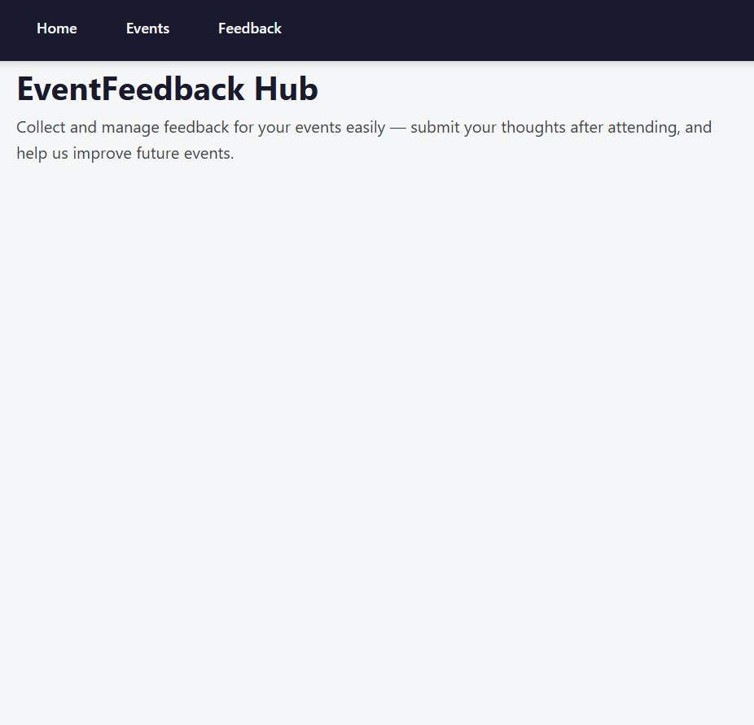
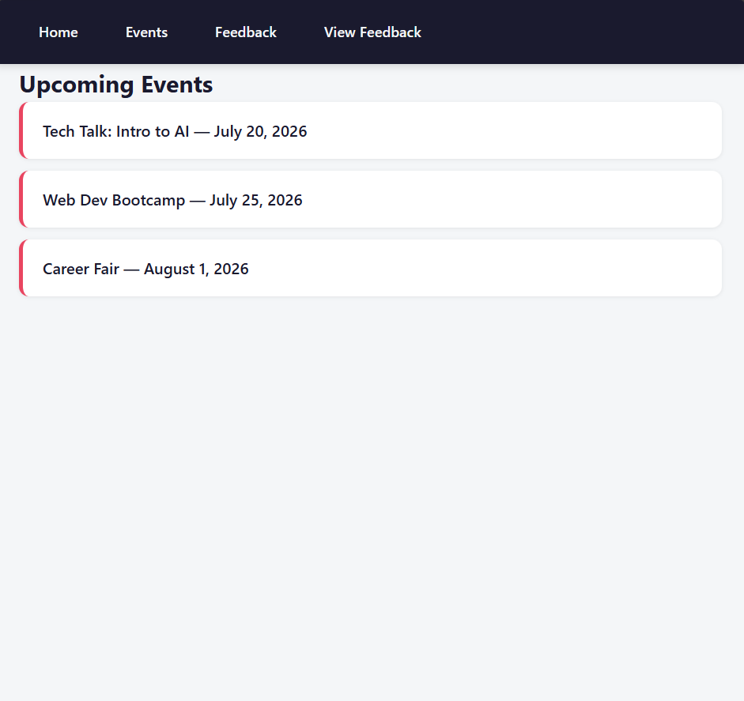
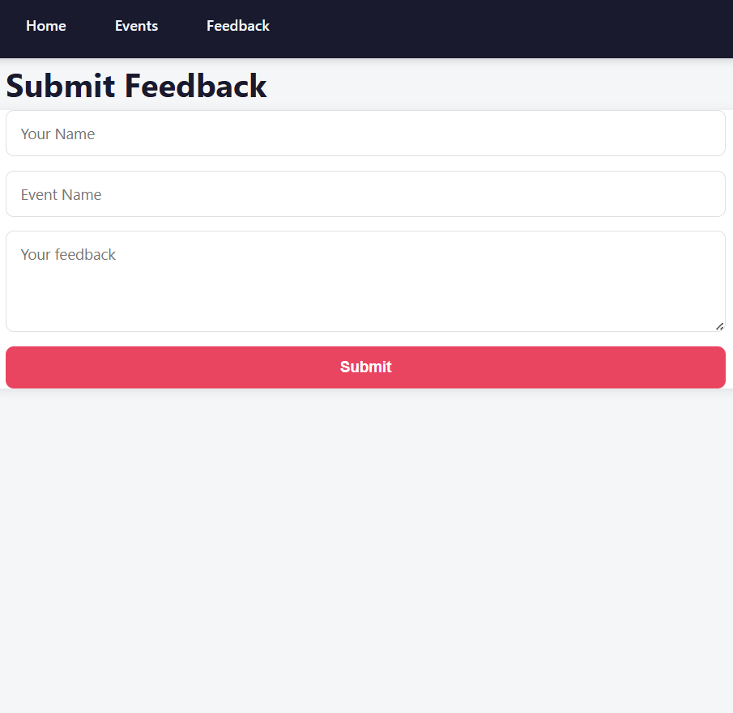
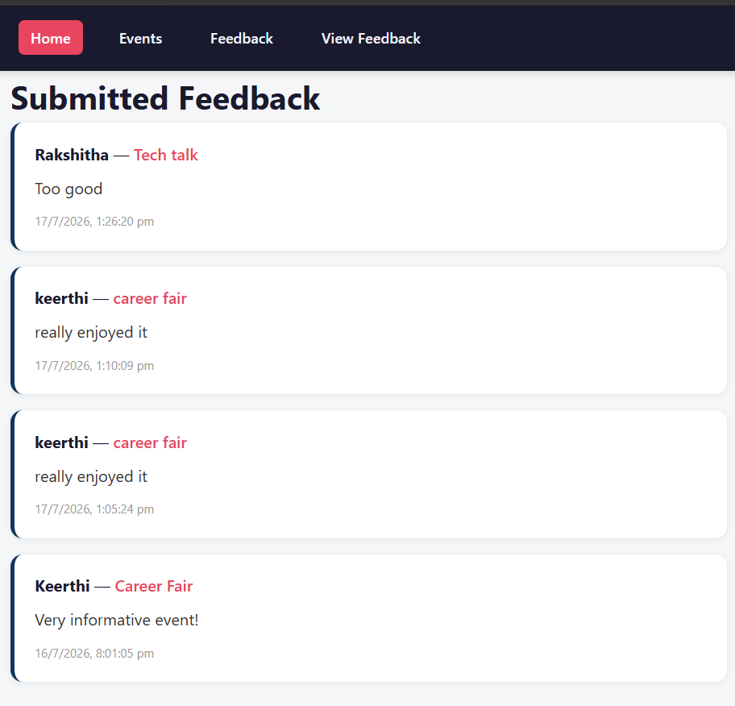

# Event Feedback Management System
**Full Stack Internship Project — Sysslan IT Solutions**

A full-stack web application that allows users to submit feedback for events through a frontend interface, stores the feedback in a MongoDB database via a Node.js/Express backend, and displays submitted feedback for review.

---

## Tech Stack

- **Frontend:** HTML, CSS, JavaScript
- **Backend:** Node.js, Express
- **Database:** MongoDB (via Mongoose)
- **Tools:** VS Code, Live Server, Postman, MongoDB Compass

---

## Project Structure

```
event-feedback-system/
├── backend/
│   ├── server.js
│   ├── models/
│   │   └── Feedback.js
│   ├── package.json
│   └── node_modules/
└── frontend/
    ├── index.html
    ├── events.html
    ├── feedback.html
    ├── view-feedback.html
    ├── script.js
    ├── view-feedback.js
    └── style.css
```

---

## Level 1: Frontend Pages

**Objective:** Create the basic frontend structure and pages for the feedback system.

- Homepage (`index.html`) with website title and description of the event feedback system
- Navigation menu linking Home, Events, Feedback, and View Feedback pages
- Events page (`events.html`) listing sample upcoming events
- Feedback page (`feedback.html`) with a basic feedback submission form

**Skills Gained:** HTML structure, navigation design, form creation, frontend layout planning

---

## Level 2: Backend Setup

**Objective:** Set up a simple backend server to handle requests and feedback submissions.

- Backend server built with Node.js and Express
- Welcome route (`GET /`) confirming the API is live
- Route to receive feedback form data (`POST /api/feedback`)
- Route to display submitted feedback (`GET /api/feedback`) — initially using temporary in-memory storage

**Skills Gained:** Backend fundamentals, routing, request handling, server setup

---

## Level 3: Database Basics

**Objective:** Introduce database storage for saving and retrieving feedback data.

- MongoDB connected via Mongoose
- Feedback schema/model (`models/Feedback.js`) defining name, event, message, and timestamp fields
- Feedback form data saved permanently to the database
- All feedback retrieved and returned from the database, sorted by newest first

**Skills Gained:** Database basics, CRUD operations, data storage, backend-database integration

---

## Level 4: Frontend & Backend Connection

**Objective:** Integrate frontend forms with backend services to create a complete data flow.

- Feedback form connected to the backend API using `fetch()`
- Success message displayed after successful feedback submission
- Dedicated "View Feedback" page fetching and displaying all submitted feedback live from the backend
- Basic validation implemented to prevent empty or whitespace-only submissions

**Skills Gained:** Frontend-backend integration, API communication, validation handling

---

## Level 5: Final Touch & Review

**Objective:** Enhance the UI, verify data flow, and finalize the project for delivery.

- Modern, card-based UI redesign with a consistent color palette and improved spacing
- All navigation links verified across every page
- Feedback data verified for accuracy between submission, database storage, and display
- Full feedback flow tested end-to-end: submission → database → live display

**Skills Gained:** UI improvement, debugging, testing, end-to-end project review

---

## How to Run This Project

### Backend
```bash
cd backend
npm install
node server.js
```
Server runs on `http://localhost:5000`

### Frontend
Open the `frontend` folder in VS Code and launch `index.html` using the **Live Server** extension.
It will run on something like `http://127.0.0.1:5500`

> **Note:** Make sure MongoDB is running locally (or update the connection string in `server.js` to your MongoDB Atlas URI) before starting the backend.

---
## Screenshots

### Homepage


### Events Page


### Feedback Form


### View Feedback Page



## API Endpoints

| Method | Endpoint | Description |
|--------|----------|-------------|
| GET | `/` | Welcome message / health check |
| POST | `/api/feedback` | Submit new feedback |
| GET | `/api/feedback` | Retrieve all feedback, newest first |

---

## Author

Built as part of the Full Stack Development internship cohort at **Sysslan IT Solutions**.
